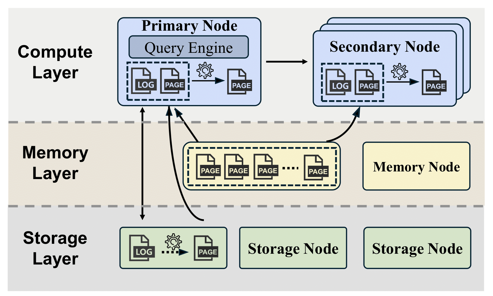
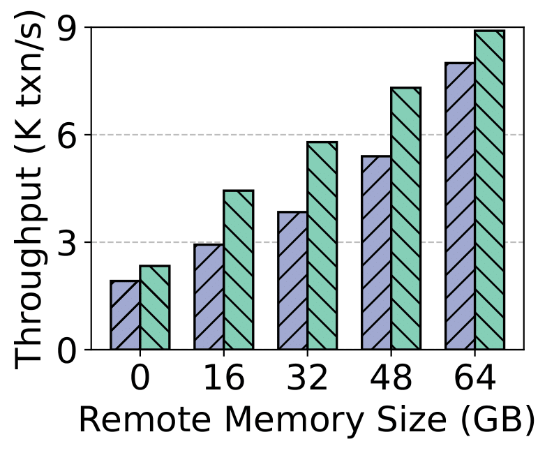
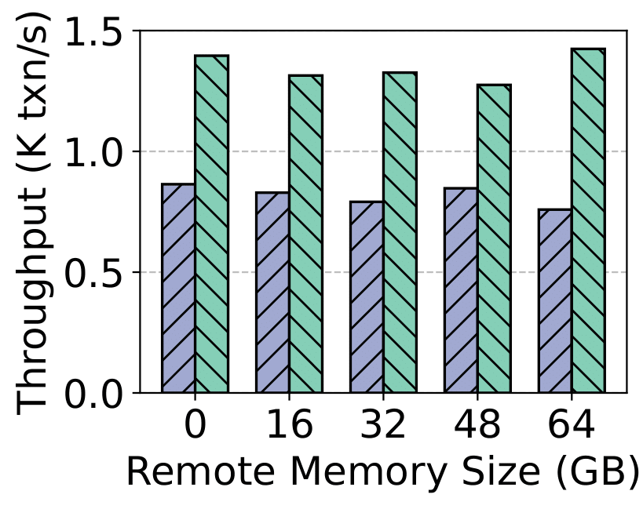
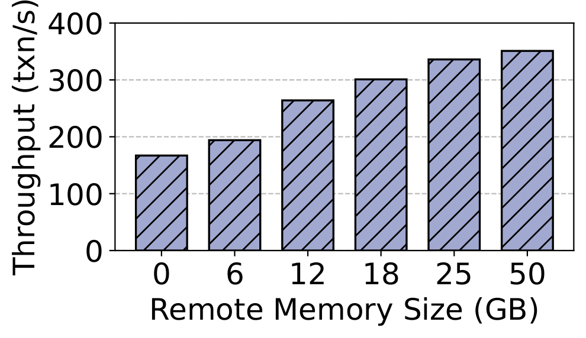
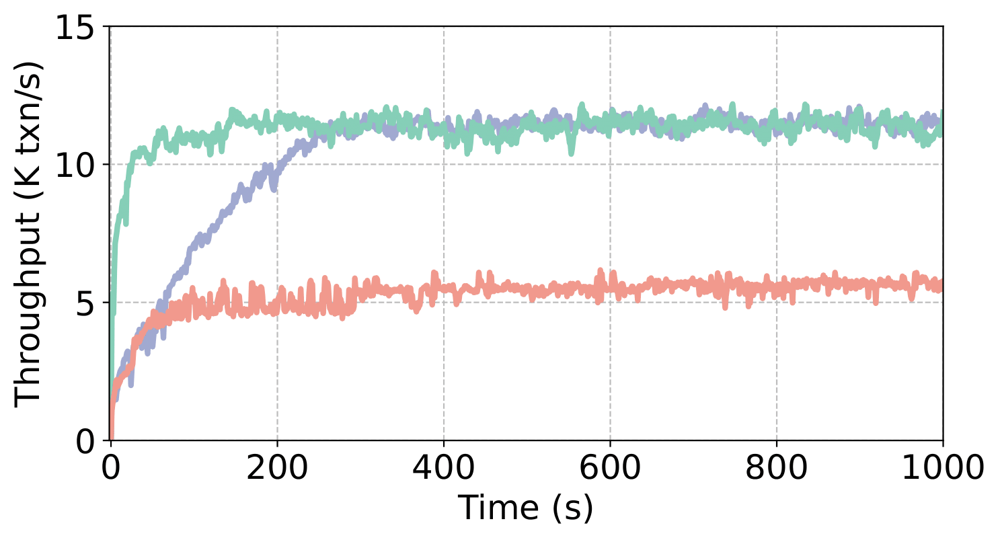
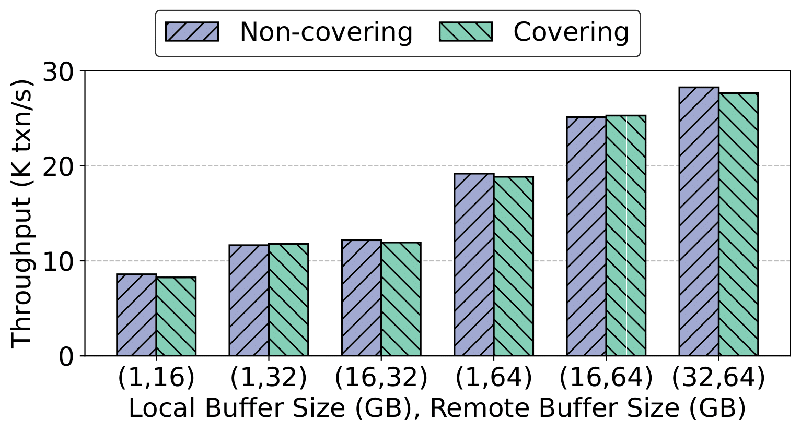
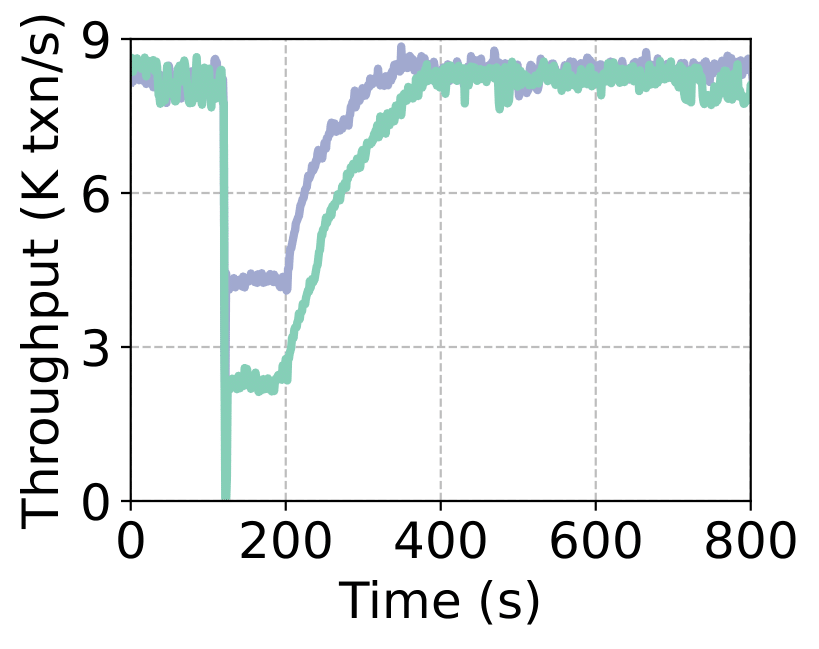
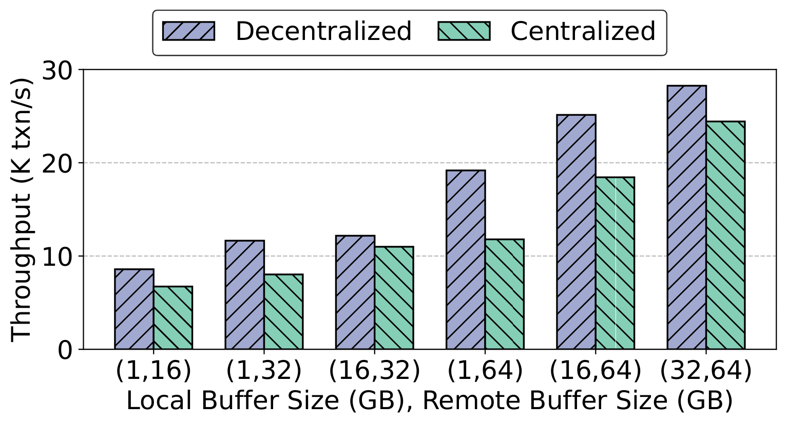

# GroundDB: Building An Open-Source Memory-Disaggregated Database System Prototype in PostgreSQL

GroundDB is the first open-source, full-fledged memory-disaggregated OLTP database system prototype based on Neon (PostgreSQL). By supporting memory disaggregation in Neon, a popular storage-disaggregated database system, GroundDB represents a substantial engineering effort to build open-source systems for database research. GroundDB physically decouples the compute engine, memory engine, and storage engine, which are deployed on different nodes. GroundDB introduces a suite of system-level optimizations, such as decentralized remote address management, one-sided RDMA-based remote memory access, asynchronous replication, multi-version page support, and buffer management across different nodes. Using GroundDB, we conduct a comprehensive end-to-end evaluation to provide guidance and insights on when and how memory disaggregation should be employed. Lastly, the open-source release of GroundDB has the potential to facilitate future research by the database community on disaggregated databases.

## Overview



## Code Structure

Below is some of the code that are closed related with disaggregation. To be noted, not all code implemented in this project is included in the diagram.

```
├── README.md                      # Project README file
├── src
│   ├── include                    # Folder for header files
│   │   ├── access                 # Folder for data access and xlogs
│   │   ├── storage                # Folder for remote storage engine layer
│   │   │   ├── GroundDB           # Folder for remote memory engine layer
│   │   ...
│   ├── backend                    # Folder for c source code
│   │   ├── bootstrap/bootstrap.c  # Launch background processes
│   │   │   ...
│   │   ├── access/logindex           # Folder for PVT and replay
│   │   │   ├── logindex_hashmap.cpp  # PVT implementation
│   │   │   ├── logindex_function.cpp # PVT update and log replay
│   │   │   ├── background_hashmap_vaccumer.cpp # PVT garbage collection
│   │   │   ├── brin_xlog_idx.cpp     # PVT update and xlog replay functions for brin index
│   │   │   ├── generic_xlog_idx.cpp  # PVT update and xlog replay functions for generic index
│   │   │   ├── gin_xlog_idx.cpp      # PVT update and xlog replay functions for gin index
│   │   │   ├── gist_xlog_idx.cpp     # PVT update and xlog replay functions for gist index
│   │   │   ├── hash_xlog_idx.cpp     # PVT update and xlog replay functions for hash index
│   │   │   ├── heap_xlog_idx.cpp     # PVT update and xlog replay functions for head data
│   │   │   ├── nbtxlog_idx.cpp       # PVT update and xlog replay functions for nb-tree
│   │   │   ...
│   │   ├── tramsam                   # Folder for transaction related functions 
│   │   │   ├── xlog.c                # Recovery and secondary compute nodes' background replay
│   │   │   ├── xlog_insert.c         # Control how to assemble xlog
│   │   │   ...
│   │   ├── storage                   # Folder for remote memory and remote storage interaction related functions
│   │   │   ├── GroundDB              # Folder for core functionalities of memory disaggregation
│   │   │   │   ├── cache.cc          # Logic for LRU list and free list on remote memory engine
│   │   │   │   ├── mempool_client.cc # Remote memory client interfaces and interaction logics for query engines
│   │   │   │   ├── mempool_server.cc # Main function of remote memory nodes
│   │   │   │   ├── pat.cc            # Remote Page Address Table (RAT)
│   │   │   │   ├── rdma_manager.cc   # RDMA manager implemention for query engines
│   │   │   │   ├── rdma_server.cc    # RDMA manager and request handler of remote memory nodes
│   │   │   │   ├── ThreadPool.cc     # Thread pool for asynchronous operations
│   │   │   ├── rpc                   # Folder for RPC logic
│   │   │   │   ├── rpcclient.cpp     # RPC client interfaces
│   │   │   │   ├── rpcserver.cpp     # GetPage@LSN logic and RPC server interfaces
│   │   │   │   ├── tutorial.thrift   # Thrift definition for RPC service
│   │   │   │   ...
│   │   │   ├── buffer                # Folder for buffer management
│   │   │   │   ├── bufmgr.c          # Read Path
│   │   │   │   ├── mempool_shmem.cc  # Shared memory support for remote memory client
│   │   │   │   ...
│   │   │   ├── file               # Folder for file access
│   │   │   │   ├── fd.c           # Multi-thread safe file access functions
│   │   │   │   ...
│   │   │   ├── ipc                # Folder for inter-processes communication
│   │   │   │   ├── ipc.c          # Shared memory registeraion 
│   │   │   │   ├── shmem.c        # Shared memory support for PVT
│   │   │   │   ...
│   │   │   ...
│   │   ├── replication            # Folder for replica functions
│   │   │   ├── walreceiver.c      # Service for receiving xlogs
│   │   │   ├── walsender.c        # Service for sending xlogs
│   │   │   ...
...

```

## Experiment Setup

### Prerequisite

- [Neon](https://github.com/neondatabase/neon)
- [RocksDB](https://github.com/facebook/rocksdb)
- [Boost v1.81.0](https://github.com/boostorg/boost)
- [Apache Thrift v0.14.0](https://github.com/apache/thrift)

### Steps

Download the codebase:

```
git clone git@github.com:testsigmod27/GroundDB.git
cd GroundDB
```

Update some of the configuration in the code if needed:

- **Storage node's IP**: in ***src/backend/access/storage/rpc/rpcclient.cpp*** line 53 macro $\texttt{PRIMARY\_NODE\_IP}$.
- **Neon pageserver's IP**: in ***src/backend/access/storage/rpc/rpcserver.cpp*** line 612.
- **Page array's size**: in ***/src/backend/storage/GroundDB/mempool_server.cc*** line 18.
- **Turn on covering policy**: in ***/src/include/storage/GroundDB/mempool_client.h*** line 35 macro $\texttt{MEMPOOL\_CACHE\_POLICY\_COVERING}$​.
- **Turn on centralized RAT**: in ***/src/include/storage/GroundDB/mempool_client.h*** line 37 macro $\texttt{MEMPOOL\_CENTRALIZED\_PAT}$.

Compile and install:

```
./configure --prefix=$INSTALL_DESTINATION LDFLAGS='-std=c++17 -lstdc++ -lrocksdb -lthrift -lrt -ldl -lsnappy -lgflags -lz -lbz2 -llz4 -lzstd -lpthread -libverbs -I. -I/usr/local/include -I/usr/include -L/usr/local/lib -L/usr/bin'
make
make install
```

Initialize an empty database instance on the storage node, and copy it to the compute nodes:

```
cd $INSTALL_DESTINATION/bin
./initdb -D $DB_INSTANCE_PATH_ON_STORAGE_NODE
scp $DB_INSTANCE_PATH_ON_STORAGE_NODE $DB_INSTANCE_PATH_ON_COMPUTE_NODE
```

Update configuration in db instance's ***postgresql.conf*** if needed (e.g. local buffer size, port number, standby servers).

Initialize a Neon instance on the storage node, and launch Neon pageserver and then the storage engine:

```
cd $NEON_INSTALL_PATH
./target/debug/pageserver -D $NEON_INSTANCE_PATH/pageserver_1/
cd $INSTALL_DESTINATION/bin
export PGDATA="$DB_INSTANCE_PATH_ON_STORAGE_NODE" 
./postgres --rpc-server
```

Launch the memory engine on memory nodes:

```
cd $INSTALL_DESTINATION/bin
./postgres --mempool
```

Configure memory nodes' IP (separated by whitespaces) on compute nodes:

```
cd $DB_INSTANCE_PATH_ON_COMPUTE_NODE/..
touch connection.conf
echo $COMPUTE_NODES_IP >> connection.conf
echo $MEMORY_NODES_IP >> connection.conf
```

Launch the query engine on compute nodes:

```
cd $INSTALL_DESTINATION/bin
export RPC_CLIENT=2     # 1 for storage-disaggregated db, 2 for memory-disaggregated primary node, 3 for memory-disaggreagted secondary node
./pg_ctl -D $DB_INSTANCE_PATH_ON_COMPUTE_NODE start
```

On compute nodes, enter psql, or try benchmarks like [SysBench](https://github.com/akopytov/sysbench):

```
cd $INSTALL_DESTINATION/bin
./psql postgres
```

## 4. Experiments

Varying remote memory sizes in SysBench read, SysBench write, and TPC-C:




Warm-up process of compute nodes:




Different buffer policies:



Crash recovery on memory nodes:




Centralized vs. decentralized RAT:



